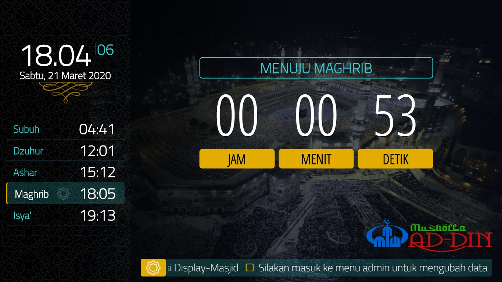

# DISPLAY MASJID - VERSI 1.0.0


Aplikasi display masjid digunakan sebagai media informasi pada masjid dan musholla.  

Aplikasi berbasis web dengan menggunakan bahasa pemrograman PHP dan penyimpanan data dalam file JSON, di design untuk board raspberry pi, penggunaan pada board/device lain mungkin tidak kompatibel atau memerlukan modifikasi program (cek pada menu MATERIAL DAN OS di bawah untuk device yang pernah dicoba).  
Aplikasi ini gratis dan open source dibawah lisensi **MIT**  


## FITUR

- **OFFLINE**, tidak memerlukan koneksi internet.
- **STANDALONE**, tidak memerlukan tambahan perangkat jaringan lain seperti router, modem, hub dll.
- Waktu sholat.  
	- Library perhitungan waktu sholat dari [praytimes.org](http://praytimes.org/).
	- Konfigurasi waktu sholat dengan koordinat dan metode perhitungan, sekali setting untuk selamanya.
		- MWL	: Muslim World League
		- ISNA	: Islamic Society of North America
		- Egypt	: Egyptian General Authority of Survey
		- Makkah	: Umm al-Qura University, Makkah
		- Karachi	: University of Islamic Sciences, Karachi
		- Tehran	: Institute of Geophysics, University of Tehran
		- Jafari	: Shia Ithna Ashari (Ja'fari)
		- Manual.
		
		> Untuk indonesia menggunakan metode dari kemenag, pilih pada manual.  
		> Cara pengisian ada pada menu admin.
	- Terdapat fitur simulasi waktu sholat di menu admin.  
		Akurasi perhitungan waktu sholat dari library [praytimes.org](http://praytimes.org/) cukup baik, sudah dicoba untuk dibandingkan dengan situs https://jadwalsholat.pkpu.or.id/ dalam kurun waktu 1 tahun (1 januari 2020 sampai 31 desember 2020) untuk wilayah bekasi, dengam koordinat dan metode yang sama, hasilnya selisih perhitungan maksimal hanya 1 menit. (file excel komparasi bisa di lihat [disini](readme-image/compare.xlsx))
	- Terdapat menu penyesuaian waktu sholat -60 sampai +60 menit.  
		Contoh penggunaan : jadwal ditambahkan +2 menit untuk ihtiyati (pengaman), dll.
- Display informasi masjid/musholla, bisa ditambah/diganti.
- Running text, bisa ditambah/diganti.
- Gambar latar belakang (wallpaper) juga bisa ditambah/diganti.
- Logo masjid/musholla bisa diganti.
- Count down menuju waktu sholat.
- Count down iqomah dan suara beep untuk peringatan waktu iqomah akan habis.
	Durasi iqomah bisa di setting berbeda pada masing-masing waktu sholat.
- Durasi waktu (timer) count down, sholat, iqomah, khutbah dan wallpaper bisa diatur.
- Display kalem pada waktu sholat dan khutbah agar tidak mengganggu.
- Sholat jum'at (opsional, bisa dimatikan)
- Sholat tarawih (opsional, bisa dimatikan)
- Menu admin mudah digunakan.  
	Menu admin bisa dijalankan dengan HP (android/iphone), laptop atau device lain secara wireless dengan koneksi wifi.  
	Menu admin web base, sehingga tidak memerlukan aplikasi tambahan, cukup menggunakan browser yang sudah ada pada HP atau laptop.  
- Untuk pengembangan, bisa digunakan untuk beberapa display di dalam masjid/musholla secara wireless, dengan konfigurasi 1 device untuk server dan device lainnya sebagai client.
	- 1 device (board raspberry pi) digunakan untuk server dengan setting seperti manual dibawah, dan ditambahkan setting NTP server (broadcast).  
	- Device lainnya hanya sebagai client yang menampilkan halaman web dari server dengan konfigurasi update waktu (NTP client) ke device server agar waktu yang ditampilkan sama (tidak perlu menambahkan modul RTC pada raspberry client). 


### Video
#### 01. Demo dan manual
[](https://youtu.be/odmJeMKmeQw)

#### 02. Demo Admin (video lama)
[](https://youtu.be/94Yjqq0RiNY)

#### 03. Instalasi
[](https://youtu.be/HfmVgQ77y5w)


### Overview





### Admin menu


----

## MATERIAL DAN OS

#### Material yang dibutuhkan:
- Raspberry PI 3 model 3B, 3B+ atau Raspberry PI 4 Model B (pada saat tulisan ini dibuat, model terbaru adalah Raspberry PI 4 Model B).  
	> Aplikasi telah di uji coba pada : 
	> - Raspberry PI 3 model 3B `OK`.
	> - Raspberry PI 3 model 3B+ `OK`.
	> - Raspberry PI 4 Model B `OK`.
	> - Raspberry PI Zero `Display Lag`.  
	 
	 **PERINGATAN! Tidak direkomendasikan menggunakan raspberry pi zero**

- Micro SD, ukuran 8Gb atau lebih besar.
- Aksesoris raspberry (charger, heatsink, casing, fan, dll sesuai kebutuhan)
- Modul RTC
- Display (TV atau monitor)

> **CATATAN**  
> - Aplikasi ini di desain untuk berjalan di board raspberry pi, namun pernah dicoba menggunakan mini PC dengan prosesor intel dual core, ram 1Gb, dengan OS Raspberry PI Desktop, bisa berjalan dengan baik. Namun untuk konfigurasi waktu tidak menggunakan manual disini (karena tidak ada tambahan modul RTC), dan setting waktu di menu admin tidak bisa digunakan, karena pada script PHP mengirim perintah untuk update waktu ke modul RTC, sehingga perlu dilakukan perubahan script pada file proses.php agar dapat digunakan.  
> - Untuk OS rasbian sendiri saat ini tersedia untuk prosesor intel dan AMD, sehingga aplikasi display masjid memungkinkan diinstal pada PC yang menggunakan Intel atau AMD dengan sedikit modifikasi pada script update jam.  
> - Untuk OS windows aplikasi bisa berjalan, namun menu `update jam`, `restart`, dan `shutdown` tidak bisa digunakan, perlu dilakukan modifikasi pada file proses.php agar dapat digunakan.

#### Operating system.
OS yang digunakan adalah raspbian (linux debian), pada saat ini dibuat versi terbaru adalah :
- Raspbian Buster
- Version 			: February 2020
- Release date 		: 2020-02-13
- Kernel version 	: 4.19
- Size				: 2530 MB

Download operasi sistem dan cara instalasi operasi sistem bisa dilihat pada website resmi [raspberry PI](https://www.raspberrypi.org/downloads/)  
> Biasanya jika anda beli paket modul raspberry sudah terinstal operasi sistem rasbian


## KONFIGURASI RASPBERRY

#### Konfigurasi awal
Jalankan raspi, pasang keyboard dan mouse lakukan konfigurasi berikut :
- Koneksikan ke jaringan dan cek ip raspberry (IP diperlukan untuk remote)
	- Untuk jaringan wifi cek pada `wlan0`, buka terminal ketik perintah :
	```
	sudo ifconfig wlan0
	```
	- Untuk ethernet port cek pada `eth0`
	```
	sudo ifconfig eth0
	```
- Enable SSH dan VNC
	- Jika melalui GUI, 
		- Buka start menu 
		- Pilih preferensi
		- Pilih konfigurasi raspberry pi
		- Pilih tab antar muka
		- Aktifkan VNC dan SSH
	- Jika melalui terminal
		- Ketik `sudo raspi-config`
		- Pilih interface dan option
		- Pilih SSH dan aktifkan
		- Pilih VNC dan aktifkan
- Ganti password (defaultnya : raspberry, untuk lebih aman sebaiknya diganti)
	- Masuk terminal, ketik `sudo raspi-config`
	- Pilih change user password
	- Ikuti menu yang tersedia.

> Default raspbian buster akan muncul wizard konfigurasi (welcome screen) pada saat pertama kali dijalankan.  
> Lihat video manual install ya kalo masih bingung (video masih progress upload youtube, link menyusul).

#### Catatan sebelum memulai instalasi:
- Diperlukan koneksi internet untuk instalasi apache, php, i2c-tools, dnsmasq dan hostapd.  
- Pada video tutorial koneksi menggunakan wifi.
- Text editor bawaan raspberry adalah nano
	- untuk menyimpan dan keluar dari nano ```CTRL + x```
	- untuk mencari text dari nano ```CTRL + w```

- Jika HDMI tidak muncul di display/monitor (biasanya terjadi pada raspberry pi 4 yang ada 2 slot HDMI)
	buka micro sd di PC dengan card reader, edit config.txt hapus komen baris berikut
	```
	# uncomment if hdmi display is not detected and composite is being output
	hdmi_force_hotplug=1
	```
- Untuk setting display monitor jika tidak pas, lebih besar dari monitor (over scan) bisa disetting juga dari config.txt
	```
	# uncomment the following to adjust overscan. Use positive numbers if console
	# goes off screen, and negative if there is too much
	border
	overscan_left=16
	overscan_right=16
	overscan_top=16
	overscan_bottom=16
	```
	Jika layar lebih kecil dari monitor (ada border hitam sekeliling monitor) bisa diisi minus
	```
	overscan_left=-10
	overscan_right=-10
	overscan_top=-10
	overscan_bottom=-10
	```
	dst....


## MANUAL INSTALASI

Untuk mempermudah, anda bisa melakukan instalasi melalui remote SSH dan VNC
> Untuk windows bisa menggunakan aplikasi putty & WinSCP.
- Jalankan putty
- Konfigurasi koneksi dengan IP, user dan password yang di setting di atas

----

### UPDATE OS
- Perintah update.
```
sudo apt-get update
```
- Perintah upgrade
```
sudo apt-get upgrade
```

----

### INSTALL APACHE DAN PHP SERVER SERTA INSTALASI WEB
- Instal apache dan PHP.
	```  
	sudo apt install apache2
	sudo apt install php php-mbstring
	```

- Ganti owner folder html.  
	Default owner pada `/var/www/html` adalah root (user pi tidak punya akses pada folder tersebut)
	```
	sudo chown -R pi:pi /var/www/html
	```
- Copy kan file aplikasi display masjid menggunakan WinSCP ke `/var/www/html`
- Ganti owner ke www-data.  
	User untuk apache adalah www-data, jadi untuk owner pada semua folder, sub folder dan file di `/var/www/html/` harus diganti ke www-data.
	```
	sudo chown -R www-data:www-data /var/www/html/
	```
	> Jika anda akan mengcopy kan file kembali dari WinSCP pada folder `/var/www/html/` maka owner harus dikembalikan ke pi :  
		```
		sudo chown -R pi:pi /var/www/html/
		```

- Enable rewrite untuk proteksi database.  
	Penyimpanan data (database) pada aplikasi ini menggunakan file json pada folder db, defaultnya file ini bisa diakses dari halaman website, sehingga user dan password aplikasi bisa terbaca, maka perlu diproteksi agar tidak dapat diakses melalui website.
	```
	sudo nano /etc/apache2/sites-enabled/000-default.conf
	```
	tambahkan baris berikut:
	```
	<Directory /var/www/html>
		AllowOverride All
	</Directory>
	```
- Restart apache server dengan perintah:
	```
	sudo systemctl restart apache2
	```
	atau
	```
	sudo service apache2 restart
	```
- Enable sound permission pada browser chrome.  
	Pada count down iqomah < 5 detik akan muncul beep, maka perlu di enable permission di chrome agar bisa bunyi.  
	- Buka browser chrome (di raspberry)
	- Alamat http://localhost/display/
	- Pilih pada `view site information` --> ada di sebelah address (lihat video / googling aja kalo gak nemu)
	- Pilih `site settings`
	- Cari `sound`
	- Pilih `allow`

----

### DISABLE SLEEP & CURSOR
Jalankan perintah berikut pada terminal.
```
sudo nano /etc/lightdm/lightdm.conf
```
Cari `xserver-command=X`, tambahkan baris berikut
```
xserver-command=X -s 0 dpms -nocursor
```

----

### MEMBUAT AUTO START
Untuk membuat auto start aplikasi display masjid di chrome.  
Jalankan perintah berikut pada terminal :
```
sudo nano /etc/xdg/lxsession/LXDE-pi/autostart
```

Tambahkan baris berikut
```
# chromium-browser --incognito --kiosk http://localhost/display/

# ada beberapa kasus di chrome yang suka muncul error gagal update 
# seperti pada forum raspi : https://www.raspberrypi.org/forums/viewtopic.php?t=264399
# solusi sementara pada saat start tambahkan update sampe setahun

chromium-browser --check-for-update-interval=31536000 --incognito --kiosk http://localhost/display/

```


> Jika menggunakan OS rasbian versi lama, session berada pada `~/.config/lxsession/`, perintah pada terminal:  
	```
	sudo nano ~/.config/lxsession/LXDE-pi/autostart
	```


----

### INSTALL RTC
- Pastikan **RTC modul** sudah terpasang pada GPIO raspberry di pin 1,3,5,7,9 (anda bisa cari di internet untuk lebih jelasnya)
- Install i2c-tools, ketik perintah berikut pada terminal:
	```
	sudo apt install i2c-tools
	```

- Ganti lokasi indonesia.  
	> jika sudah setting pada wizard saat pertama kali menjalankan os raspberry pi, proses ini bisa dilewati.  
	- Ketik perintah berikut pada terminal:
	```
	sudo raspi-config
	```
	- pilih di menu :
		- 4 Localisation Options
		- I2 Change Timezone  
		- Asia
		- Jakarta  
		
	tekan tab untuk ke menu finish

- Aktifkan  i2c
	- Ketik perintah berikut pada terminal:
		```
		sudo raspi-config
		```
	- Pilih di menu :
		- 5 Interfacing Options 
		- P5 I2C 
		- Pada menu `Would you like the ARM I2C interface to be enabled?`, pilih yes
	
- Detect modul RTC
	```
	sudo i2cdetect -y 1
	```
	jika sudah dipasang dengan benar biasanya akan muncul pada channel 68
	```
	 0  1  2  3  4  5  6  7  8  9  a  b  c  d  e  f
	00:          -- -- -- -- -- -- -- -- -- -- -- -- -- 
	10: -- -- -- -- -- -- -- -- -- -- -- -- -- -- -- -- 
	20: -- -- -- -- -- -- -- -- -- -- -- -- -- -- -- -- 
	30: -- -- -- -- -- -- -- -- -- -- -- -- -- -- -- -- 
	40: -- -- -- -- -- -- -- -- -- -- -- -- -- -- -- -- 
	50: -- -- -- -- -- -- -- -- -- -- -- -- -- -- -- -- 
	60: -- -- -- -- -- -- -- -- 68 -- -- -- -- -- -- -- 
	70: -- -- -- -- -- -- -- --        
	```

- Tambahkan konfigurasi RTC pada boot config.  
	Ketik perintah berikut pada terminal:
	```
	sudo nano /boot/config.txt
	```
	Tambahkan pada baris terakhir
	```
	dtoverlay=i2c-rtc,ds3231
	```

- Tambahkan module RTC.  
	Ketik perintah berikut pada terminal:
	```
	sudo nano /etc/modules
	```
	Tambahkan pada baris terakhir
	```
	rtc-ds3231
	```

- Edit File /lib/udev/hwclock-set.  
	Ketik perintah berikut pada terminal:
	```
	sudo nano /lib/udev/hwclock-set
	```
	Berikan Comment pada baris berikut :
	```
	#if [ -e /run/systemd/system ] ; then
	# exit 0
	#fi
	```

- Lakukan restart raspberry
	```
	sudo reboot
	```


- Beberapa perintah untuk modul RTC.  
	- Membaca waktu dari Raspberry
		```
		date
		```
	- Mengganti Waktu pada Raspberry
		```
		sudo date -s “DD MMM YYYY HH:MM:SS”
		```
	- Mengganti waktu pada RTC
		```
		sudo hwclock --set --date="YYYY-MM-DD HH:MM:SS" --localtime
		```
	- Membaca Waktu dari Module RTC
		```
		sudo hwclock -r 
		```
	- Menulis waktu ke Module RTC Dari Raspberry.
		```
		sudo hwclock -w
		```
	- Menulis waktu Ke Raspberry Dari Module RTC
		```
		sudo hwclock -s
		```

- Lain-lain.  
Script PHP update jam pada proses.php adalah:
	```php
	/*
	format waktu $this->dt adalah YYYY-MM-DD HH:MM:SS
	*/
	private function updateClock(){
		//update jam rtc
		$update = exec ('sudo hwclock --set --date="'.$this->dt.'" --localtime');
		//raspi update dari rtc
		exec ('sudo hwclock -s');
		if($update)
			$this->retError('Error : '.$update);
		else
			$this->retSuccess();
	}
	```
	jika menggunakan board selain raspberry pi, lakukan modifikasi pada fungsi diatas

----

### BERI AKSES PADA APACHE
User untuk apache server adalah www-data, defaultnya tidak memiliki akses apapun ke sistem.
- Akses www-data untuk shutdown, restart, update jam.  
	Jalan perintah berikut pada terminal:
	```
	sudo visudo
	```
	tambahkan baris berikut
	```
	www-data ALL = NOPASSWD: /sbin/reboot, /sbin/shutdown, /sbin/hwclock
	```
	> editor disini masih menggunakan nano sehingga untuk menyimpan dan keluar masih menggunakan `CTRL + x`
	
- Akses untuk cek temperatur
	```
	sudo usermod -G video www-data
	```
	> code pada PHP nya :
	```php
	<?php
		$temp	= exec("/opt/vc/bin/vcgencmd measure_temp | egrep -o '[0-9]*\.[0-9]*'");
		echo $temp . '&#176;C';
	?>
	```
	
- Restart apache 
	```
	sudo service apache2 restart
	```	

----

### SET AS ACCESS POINT
Menjadikan raspberry sebagai akses poin wifi untuk admin display masjid.  
- Install dnsmasq dan hostapd.  
	Jalan perintah berikut pada terminal:
	```
	sudo apt install dnsmasq hostapd
	```
- Stop service.  
	Jalan perintah berikut pada terminal:
	```
	sudo systemctl stop dnsmasq
	sudo systemctl stop hostapd
	```
- Setting IP static pada wireless.  
	Jalan perintah berikut pada terminal:
	```
	sudo nano /etc/dhcpcd.conf
	```
	tambahkan baris berikut
	```
	interface wlan0
		static ip_address=10.10.10.10/24
		nohook wpa_supplicant
	```

- Restart service dhcpcd.  
	Jalan perintah berikut pada terminal untuk restart dhcp:
	```
	sudo service dhcpcd restart
	```
	 **PERINGATAN!  JANGAN JALANKAN RESTART DHCPCD JIKA ANDA KONEKSI KE RASPBERRY VIA REMOTE**  
	> jangan dijalankan jika via remote, karena akan mematikan koneksi wifi raspberry ke access point.  

- Configuring the DHCP server (dnsmasq).  
	- Backup dulu config lama.
		```
		sudo mv /etc/dnsmasq.conf /etc/dnsmasq.conf.orig
		```
	- Buat config baru
		```
		sudo nano /etc/dnsmasq.conf
		```
		isikan baris berikut
		```
		interface=wlan0
		dhcp-range=10.10.10.100,10.10.10.120,255.255.255.0,24h
		```

	- Jalankan service dnsmasq
		```
		sudo systemctl start dnsmasq
		```

- Konfigurasi akses poin
	- Konfigurasi hostapd
		```
		sudo nano /etc/hostapd/hostapd.conf
		```
		isi berikut:
		```
		interface=wlan0
		driver=nl80211
		hw_mode=g
		channel=6
		ieee80211n=1
		wmm_enabled=1
		ht_capab=[HT40][SHORT-GI-20][DSSS_CCK-40]
		macaddr_acl=0
		ignore_broadcast_ssid=0

		# Use WPA2
		auth_algs=1
		wpa=2
		wpa_key_mgmt=WPA-PSK
		wpa_pairwise=TKIP
		rsn_pairwise=CCMP

		# nama SSID bisa diganti sesuai keinginan anda
		ssid=DisplayMasjid

		# password wifi, bisa anda ganti juga
		wpa_passphrase=12345678
		```

	- Default hostapd
		```
		sudo nano /etc/default/hostapd
		```
		cari DAEMON_CONF (`CTRL +w`), hilangkan komen dan isikan berikut
		```
		DAEMON_CONF="/etc/hostapd/hostapd.conf"
		```
	- Enable hostapd
		```
		sudo systemctl unmask hostapd
		sudo systemctl enable hostapd
		```
	- Start hostapd.  
		- jika tidak lewat remote bisa jalankan perintah berikut:
			```
			sudo systemctl start hostapd
			```
		- jika via remote lakukan restart
			```
			sudo reboot
			```

- Setelah restart, raspberry akan menjadi akses point 
	- SSID : DisplayMasjid
	- Password : 12345678
	- Alamat ip raspberry : 10.10.10.10  
	
	> Untuk konfigurasi admin display masjid, koneksikan HP/Laptop ke akses poin tesebut dan buka browser dengan alamat http://10.10.10.10/  
	>	- User : admin
	>	- Password : admin

- Troubleshoting.  
	- cara cek hostapd
		```
		sudo systemctl status hostapd
		```
	- cara cek dnsmasq
		```
		sudo systemctl status dnsmasq
		```

	- Jika raspberry tidak menjadi akses point.  
		- Untuk mengembalikan menjadi client (wifi)
			```
			sudo nano /etc/dhcpcd.conf
			```
			komen pada baris :
			```
			#interface wlan0
			#static ip_address=10.10.10.10/24
			#nohook wpa_supplicant
			```
		- Cek kesalahan pada konfigurasi akses point:
			```
			sudo nano /etc/hostapd/hostapd.conf
			```
<hr>

### LISENSI
MIT license

<hr>

### DONASI  
Dukung saya 
- [Traktir kopi](https://sociabuzz.com/fahroniganteng/tribe)
- [atau Es krim](https://trakteer.id/fahroniganteng/tip) 
